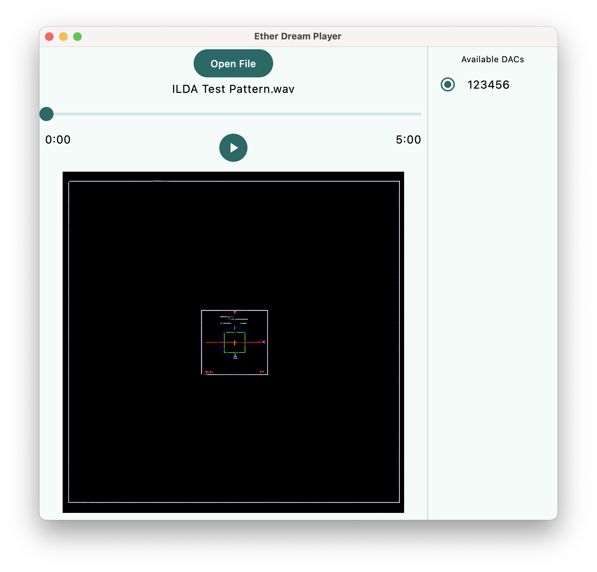

## Ether Dream WAV Player

This is a tool to play 8-channel WAV files to an Ether Dream, such as those backed up
from an ADAT tape. Channels 7 and 8 are used as audio and played out the system audio
device; channels 1-5 are X, Y, R, G, B, respectively. Channel 6 is ignored.

A preview window shows an approximation of the content in the file. This is not meant
as an accurate visualization of what would be projected, but rather as an aid to identifying
files and seeking for a position within the file.

Ether Dreams found on the network will appear in the list to the right of the preview window.
If no Ether Dream is selected, the file can still be played in preview mode.



Binaries are available via [GitHub Releases](https://github.com/j4cbo/EtherDreamPlayer/releases). With a JDK
installed, you can also compile and run directly:

```shell
./gradlew :composeApp:run
```
